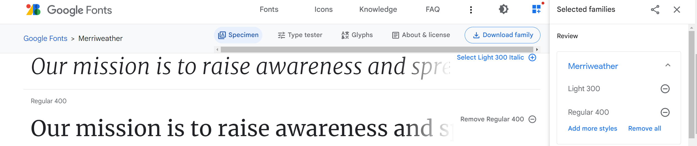
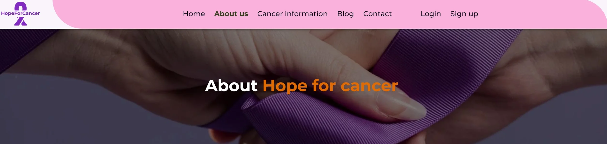
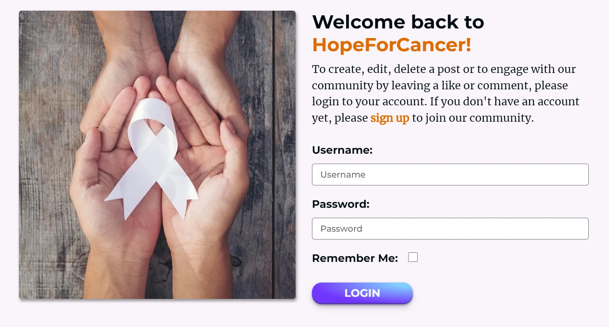
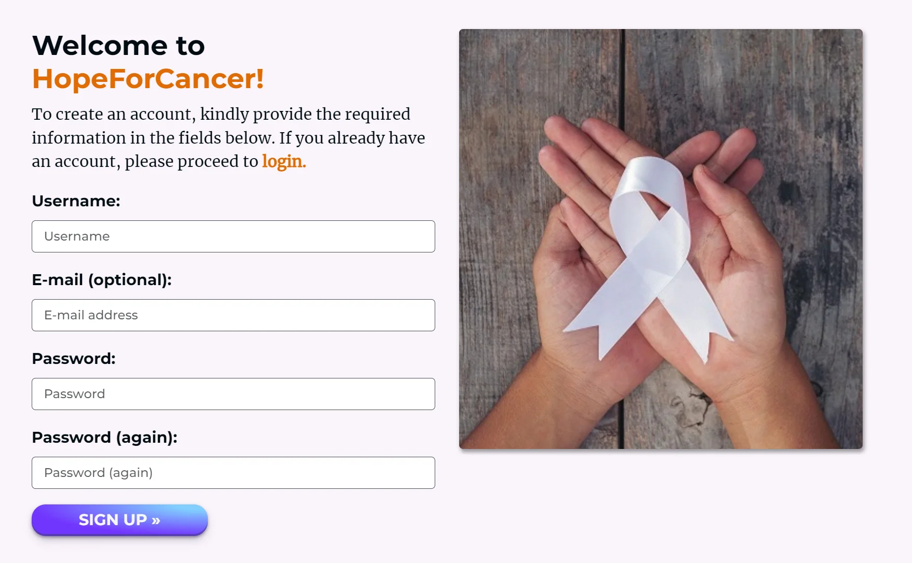

# HopeForCancer - Introduction

**Welcome to HopeForCancer**  
This is an informational blog webapp created using the Django Framework and related contemporary technologies, as a component of Portfolio Project 4 for my Diploma in Full Stack Software Development at Code Institute.

**Our Story**  
HopeForCancer is a web application that aims to raise awareness about cancer and provide resources to those affected by it. The idea for the project originated from a personal experience: the author, **Edmir Demaj**, lost his father to cancer in November 2022. Recognizing the need for a comprehensive and user-friendly resource for those affected by cancer, Edmir set out to create a platform that would do just that. The mission of HopeForCancer is to provide support and information to cancer patients, survivors, and their families, and to spread awareness about the importance of early detection and prevention.

You can view the live site here: [HopeForCancer](https://hope-for-cancer.herokuapp.com/)


----

## [Content](#content)
- [HopeForCancer - Introduction](#hopeforcancer---introduction)
  - [User Experience - UX](#user-experience---ux)
    - [Site Aims](#site-aims)
    - [Target Audience](#target-audience)
    - [Agile Methodology](#agile-methodology)
      - [Epics and User Stories](#epics-and-user-stories)
  - [Design](#design)
    - [Colours](#colours)
    - [Typography](#typography)
    - [Imagery](#imagery)
    - [Mock Up Designs](#mock-up-designs)
  - [Database Diagram](#database-diagram)
  - [Features](#features)
    - [Home Page](#home-page)
      - [Navbar](#navbar)
      - [Hero Image](#hero-image)
      - [Cancer Information](#cancer-information)
      - [Understanding Cancer](#understanding-cancer)
      - [Latest Blog Post](#latest-blog-post)
      - [Footer](#footer)
    - [About us Page](#about-us-page)
      - [Hero Image About](#hero-image-about)
      - [Our Mission](#our-mission)
      - [Our Values](#our-values)
      - [Our Team](#our-team)
    - [Cancer Info Page](#cancer-info-page)
      - [Hero Image Info](#hero-image-info)
      - [Cancer Facts](#cancer-facts)
      - [Cancer Types](#cancer-types)
      - [Detection and Prevention](#detection-and-prevention)
    - [Blog Page](#blog-page)
      - [Hero Image Blog](#hero-image-blog)
      - [Blog Post](#blog-post)
      - [Post Details](#post-details)
      - [Blog Comments](#blog-comments)
    - [Contact Page](#contact-page)
      - [Hero Image Contact](#hero-image-contact)
      - [Contact Form](#contact-form)
      - [FAQs](#faqs)
    - [Accounts](#accounts)
      - [Login](#login)
      - [Logout](#logout)
      - [Signup](#signup)
    - [Alert Messages](#alert-messages)
    - [Error 404](#error-404) 
  - [Features Left to Implement](#features-left-to-implement)      
  - [Admin Panel](#admin-panel)
  - [Technologies Used](#technologies-used)
    - [Languages Used](#languages-used)
    - [Django Packages](#django-packages)
    - [Frameworks - Libraries - Softwares Used](#frameworks---libraries---softwares-used)
    - [Other Technologies Used](#other-technologies-used)
  - [Testing](#testing)
      - [Validation](#validation)
      - [Manual Testing](#manual-testing)
  - [Bugs](#bugs)
      - [Fixed Bugs](#fixed-bugs)
      - [Unfixed Bugs](#unfixed-bugs)
  - [Deployment](#deployment)
      - [Creating the Django project](#creating-the-django-project)
      - [Create your Heroku app](#create-your-heroku-app)
      - [Set up Environment Variables](#set-up-environment-variables)
      - [Heroku Deployment](#heroku-deployment)
      - [Final Deployment](#final-deployment)
  - [Credits](#credits)
    - [Code](#code)
    - [Information Sources / Resources](#information-sources--resources)
    - [Content and Media](#content-and-media)
  - [Acknowledgement](#acknowledgement)

-----

# User Experience - UX

## Site Aims

* Raise awareness about cancer and its impact on individuals, families, and communities.
* Provide educational resources about cancer, prevention and early detection.
* Empower and support individuals and families affected by cancer with access to information, resources, and community support.
* Foster a sense of connection and community among individuals affected by cancer, including survivors, patients, caregivers, and their loved ones.
* Promote a positive and compassionate approach to cancer care and support.
* Provide a user-friendly and accessible platform for individuals to find information, connect with resources, and share their experiences.

## Target Audience

**Primary Target Audience:**
* Individuals who have been diagnosed with cancer and their families
* Cancer survivors and their families
* Individuals who are at high risk of developing cancer

**Secondary Target Audience:**
* General audience interested in learning about cancer, prevention and treatment
* Healthcare professionals and cancer organizations

## Agile Methodology

The Agile methodology was chosen for this project to ensure flexibility and responsiveness to changes that may arise during the development process. It is used Github and the Project Board to implement Agile practices. User stories were initially entered into the 'To Do' column on the Kanban board, which served as the project's backlog. As development progressed, user stories were moved into the 'In Progress' column. Once a user story was fully developed, it was moved to the 'Done' column. This process allowed for continuous development and testing, with the ability to pivot and make changes as needed. Overall, the use of Agile methodology and the Kanban board in Github was effective in keeping the work organized and on task, resulting in a successful project.

Please find my GitHub Kanban Board with all Epics, User Stories and Tasks [here.](https://github.com/users/Edmir-Demaj/projects/4)

<details><summary>Please find my Epic & User Story templates:</summary>


</details>

<details><summary>Please find my Milestone project:</summary>

</details>

## Epics and User Stories
<details><summary>Epic 1: User experience and interface design.</summary>

---

### User Story 1.1: Visually appealing website layout.
- As a **Site User**, I want to **see that the website has a visually appealing layout**, so that I **enjoy using it and am more likely to return to it.**

### Tasks:
* Get inspiration from modern and visually appealing website layouts.
* Design and implement a colour palette that complements the website's purpose and is visually appealing.
* Choose and implement appropriate fonts that enhance readability.
* Create a layout that is clean and easy to navigate.
* Use proper images and icons for better UX.

### User Story 1.2: Clear and intuitive navigation menu.  
- As a **Site User**, I want to **see that the website has a clear and intuitive navigation menu**, so that I **can easily find the information I need.**

### Tasks:
* Create a wireframe of the navigation menu using a design tool.
* Develop the navigation menu template using HTML and style it with CSS or Bootstrap.
* Implement interactivity to the navigation menu.
* Test the navigation menu functionality.

### User Story 1.3: Responsive design.  
- As a **Site User**, I want to **navigate a responsive design**, so that I **can access it from any device and screen size.**

### Tasks:
* Create a custom responsive design or use a responsive framework.
* Test the website on different screen sizes and devices to ensure proper layout and functionality, mostly during the development stage.

### User Story 1.4: Website loading time.  
- As a **Site User**, I want to **see a quick loading time for the website**, so that I **don't have to wait a long time to access the information I need.**

### Tasks:
* Optimize images and other media files to reduce their size and improve loading speed.
* Minimize the use of external scripts and resources that can slow down the website.
* Use a content delivery network (CDN) to distribute the website content.
* Test the website with Google Lighthouse for performance and follow the feedback to improve loading speed.

### User Story 1.5: Accessible design.  
- As a **Site User**, I want to **navigate a website that has an accessible design**, so that I **or people with disabilities can use it easily.**

### Tasks:
* Use semantic HTML markup to provide structure and context for screen readers.
* Add alt tags to all images.
* Use colour contrast.
* For all form fields use labels.
* Use aria-label for internal & external links.

</details>

<details><summary>Epic 2: Home/Landing page.</summary>

---

### User Story 2.1: Website purpose.
- As a **First-Time User**, I want to **be able to easily understand the purpose of the website**, so that I **can get a fast understanding of what is about.**

### Tasks:
* Create a hero section on the landing page with a clear message about the purpose of the website and a meaningful image.
* Design a logo that describes the purpose of the website.
* Use colours that can define the purpose of the website.

### User Story 2.2: Quick access to main information.
- As a **Site User**, I want to **quickly access main information about cancer**, so that I **don't need to read other materials in which I might not have an interest.**

### Tasks:
* Create a Call To Action button CTA, which will bring the user to the Cancer Information page.
* Style this button with eye-catching colour and proper size.

### User Story 2.3: Brief introduction.
- As a **First-Time User**, I want to **be able to get a brief introduction about cancer**, so that I **can understand what this website cover and if I want to stay or leave the site.**

### Tasks:
* Provide 3 cards with a brief introduction to What is Cancer, the Types of Cancers and the Importance of Early Detection.
* Give these Cards an appealing layout and style.
* Add to each Card an image that gives meaning to the content.
* Create a button if the user wants to learn more about the related subtopic.

### User Story 2.4: Select a topic related to cancer.
- As a **Site User**, I want to **be able to select a topic related to cancer**, so that I **can easily find information on the topic I am interested in.**

### Tasks:
* Create a dropdown menu for selecting topics.
* Populate the dropdown menu with a list of topics related to cancer.
* Ensure that the selected topic is saved and displayed on the page.
* Test the dropdown menu functionality to ensure it is working as expected.

### User Story 2.5: Latest Blog posts on Home page.
- As a **Site User**, I want to **see a section on the home page that displays the latest blog posts**, so that I **can easily access and read the most recent posts.**

### Tasks:
* Create a section on the home page to display the latest blog posts.
* Design the layout of the blog post section on the home page.
* Implement a function to retrieve the latest 3 blog posts from the database.
* Test the functionality and appearance of the blog post section on the home page.

</details>

<details><summary>Epic 3: About this web application.</summary>

---

### User Story 3.1: Web application mission.
- As a **First-Time User**, I want to **easily understand the mission of the website**, so that I **can understand if is the right website I am looking for.**

### Tasks:
* Create a website mission section and provide this information to the user with text and a related image.
* Create a clean design for this section.
* Provide a short and clean mission message to the user.

### User Story 3.2: Web application values.
- As a **First-Time User**, I want to **understand the values of this website**, so that I **can understand how the site treats cancer in the community and if is helpful for me.**

### Tasks:
* Add a section where all the values of using this website are listed and explained to the user.
* Describe these values as short as possible.
* Provide images to give meaning to each value section.

### User Story 3.3: Team behind the website.
- As a **First-Time User**, I want to **know about the team behind this website**, so that I **know who is providing these services.**

### Tasks:
* Add a section where is described team behind planning and developing this website.
* Add an image of the team in order to be more friendly with users and make them feel secure while using the site.

</details>

<details><summary>Epic 4: Cancer Information.</summary>

---

### User Story 4.1: Key cancer facts.
- As a **Site  User**, I want to **be able to see key cancer facts**, so that I **can easily understand and remember important information about cancer.**

### Tasks:
* Create or find an image that presents the information in an understandable and visually appealing way.
* Ensure the image is optimized for fast loading and compatible with different devices and screen sizes.
* Add alternative text to the image for users who may have difficulty seeing the image.

### User Story 4.2: Detailed information about cancer.
- As a **Site User**, I want to **easily access detailed information about cancer, including its types, causes, prevention, and importance of early detection**, so that I **can educate myself on this disease and take necessary precautions.**

### Tasks:
* Research and gather information on different types of cancers, causes, and preventive measures.
* Create an organized and easy-to-understand format for presenting the information on the website.
* Test the information layout and design for user-friendliness and readability.

### User Story 4.3: Access to external resources.
- As a **Site User**, I want to **be able to access more detailed and professional information about cancer provided by experts and is up-to-date**, so that I **can get answers to many more questions I might have and help me better understand cancer in general.**

### Tasks:
* Create a button to engage users with external resources.
* Design an appealing button.
* Add functionality and test it.

</details>

<details><summary>Epic 5: Blog posts managment.</summary>

---

### User Story 5.1: All blog posts.
- As a **Site User**, I want to **be able to view all blog posts**, so that I **can stay up-to-date on the latest content and see all posts.**

### Tasks:
* Create a blog post section that displays the most recent posts at the top.
* Include the post title, author, date, and a brief summary.
* Create database models for posts, categories, and comments and migrate them.
* Create URLs and views to render data from the backend to the front for users.

### User Story 5.2: Apply CRUD for User/Admin post.
- As a **Site User/Admin**, I want to **be able to create, read, update, and delete posts**, so that I **can manage the content I share on the website.**

### Tasks:
* Create a form for users/admin to add new posts.
* Create a page to display all posts.
* Implement an edit button for users/admins to modify their posts.
* Implement a delete button for users/admins to remove posts.
* Implement a confirmation message for deleting posts.
* Validate post data on the server side to prevent incorrect information.

### User Story 5.3: Delete comments before aproval.
- As an **Admin**, I want to **to review and delete comments before approving them**, so that I **filter out objectionable comments and maintain the quality of content on the website.**

### Tasks:
* Add a feature to the admin dashboard that displays all pending comments.
* Allow the admin to read each comment and decide whether to approve or delete it.
* If the admin approves a comment, add it to the website's comment section for that post.

### User Story 5.4: Detailed Blog post.
- As a **Site User**, I want to **be able to view a single blog post in detail**, so that I **can read more information about a particular post.**

### Tasks:
* Design a layout for displaying a single blog post in detail, with clear headings and text.
* Create a button or link to navigate to the single post page from the main blog page.
* Ensure that the single post page is responsive to different screen sizes.

</details>

<details><summary>Epic 6: Comment and Like managment.</summary>

---

### User Story 6.1: Leave comments on a post.
- As a **Logged-In User**, I want to **leave comments on a post**, so that I **so that I can participate in discussions and share my thoughts with others.**

### Tasks:
* Implement a comment section on each post page.
* Allow logged-in users to submit comments and associate them with the post.
* Validate comments to ensure they meet site guidelines and do not contain inappropriate content.
* Store comments in a database and retrieve them when the posting page is loaded.
* Display comments below the post content, with the most recent comments shown first.
* Provide an option for users to edit or delete their own comments.

### User Story 6.2: Like or Unlike a post.
- As a **Logged-In User**, I want to **be able to like or unlike a post**, so that I **can show my appreciation or dislike for the content.**

### Tasks:
* Implement a like/unlike button on each post.
* Store user's like/unlike status in the database.
* Update the number of likes/unlikes on the post in real time.

</details>

<details><summary>Epic 7: Registration and account managment.</summary>

---

### User Story 7.1: Register an account.
- As a **Site User**, I want to **register an account**, so that I **can interact with the content by commenting and liking posts.**

### Tasks:
* Create a user registration page with appropriate input fields for username, email, and password.
* Implement server-side validation for the registration form to ensure that all required fields are filled out and that the username and email are unique.
* Create a login page that allows users to enter their credentials and authenticate their accounts.
* Allow registered users to leave comments and like posts.

### User Story 7.2: Log In and Log Out from the site.
- As a **Registered Site User**, I want to **be able to log in and log out of the site**, so that I **can access my account information and manage my content.**

### Tasks:
* Create a login page with input fields for username and password.
* Implement an authentication system to verify user credentials upon login attempt.
* Create a logout button or link that logs the user out of their session.

### User Story 7.3: Create posts as a registered user.
- As a **Registered Site User**, I want to **create posts**, so that I **can share my stories and get involved with the site community.**

### Tasks:
* Design the UI for creating a post.
* Implement a form for creating a post with fields such as title, content, category, tags, and featured image.
* Validate the user inputs to ensure that they are not empty or invalid.
* Display a success message to the user after the post is created.
* Allow the user to edit and update their posts.
* Display a confirmation message before deleting a post.

</details>

<details><summary>Epic 8: Contact page funcionality.</summary>

---

### User Story 8.1: Contact form.
- As a **Site User**, I want to **be able to fill out a contact form**, so that I **can send a message to the website administrators.**

### Tasks:
* Create a simple contact form with fields for name, email, subject, and message.
* Ensure that the form is properly validated and any errors are displayed to the user.

### User Story 8.2: Receive messages from contact form.
- As an **Admin**, I want to **be able to receive messages sent via the contact form**, so that I **provide support and assistance to site users.**

### Tasks:
* Set up a system to receive email notifications when a contact form is submitted.
* Consider adding an FAQ  to the website to proactively address common questions or issues raised via the contact form.

</details>

# Design

## Colours

The color palette for this project features five main colors:  
#010B13 - this is a very dark blue, almost black color  
#F9F4FB - this is a very light pinkish-white color  
#FAB1DC - this is a light pink color often associated with breast cancer awareness  
#E06B02 - this is an orange color often associated with kidney and leukemia cancer  
#8129C1 - this is a bright purple color, often associated with cancer awareness   

The background of the site is set to light-pinkish, creating a calm and clean atmosphere. The navbar uses light pink, which is the color commonly associated with breast cancer awareness. The color bright orange is used to emphasize important words or keywords on the site. Bright purple is another color that is used for emphasis,mostly buttons, and is often associated with all types of  cancer. Lastly, dark blue is used for text to provide a good contrast against the background and improve readability.  Overall, the color palette is designed to create a visually appealing and informative experience for users.


## Typography

For typography, the web app uses Google Fonts. The header font is Montserrat, which has a modern and clean style that creates a great visual impact. For the body text, Merriweather is used, a font that enhances readability and provides a comfortable reading experience. As a backup fonts are used Sans-Serif and Serif. Together, these fonts create a professional and visually pleasing design that aligns with the web app's mission of raising awareness about cancer.




## Imagery

All images used on this project are free copyrights. They are used to convey a message or evoke a particular emotion related to the subject of cancer. Also they are used to add visual interest to the website and to help break up text-heavy pages like about or info page. Imagery is relevant to the content and mission of the website and is also appropriately sized and optimized for web use to ensure fast page loading times. All images are in .webp format.

## Mock Up Designs

All of the mock up designs for the web app were created using [Figma](https://www.figma.com/), a popular design tool known for its versatility and collaborative features. During design stage was kept in mind the principles of UX (User Experience) and UI (User Interface) design throughout the process to ensure that designs are intuitive, user-friendly, and visually appealing. Additionally, the mock up designs are responsive and optimized for use on tablets and mobile devices, to provide a seamless experience across different screen sizes.

<details><summary>Home Page:</summary>

</details>
<details><summary>About us Page:</summary>

</details>
<details><summary>Info Page:</summary>

</details>
<details><summary>Blog Page:</summary>

</details>
<details><summary>Contact Page:</summary>

</details>
<details><summary>Login & Signup Page:</summary>

</details>
<details><summary>Post Details Page:</summary>

</details>
<details><summary>Create Post Page:</summary>

</details>


# Database Diagram
[SmartDraw](https://www.smartdraw.com/) was used to create and design the database schema for the project. This schema served as a guiding blueprint for every database model implemented. Below, you will find the database structure for each Django app utilized in the HopeForCancer project. The schema effectively illustrates each entity and any existing relationships between them.


[Back to top ⇧](#content)

# Features

## Home Page

### Navbar
On the landing page, users will be presented with a visually appealing and user-friendly navbar positioned at the very top. This navbar contains all the necessary links and accessibility options for easy navigation and is fully responsive. On the very left side is positioned the Logo of the website with link to navigate to home page. Navbar is kept same in all the pages for ease of navigation.


### Hero Image

Creating a strong first impression with the user is crucial, and to achieve this, a hero image with 100% screen width and 90% screen height was employed. This hero image acts as an automated carousel, displaying three distinct images accompanied by engaging headings that effectively communicate the purpose and essence of the web app. Additionally, a call-to-action (CTA) button is incorporated to encourage users to explore further and gather more information. The design is fully responsive, ensuring seamless adaptation across various screen sizes.


### Cancer Information

In order to engage users effectively, it is essential to provide a concise introduction using cards that contain both textual content and visually meaningful images. This project extensively utilizes images as they aid in visual memorization and facilitate faster comprehension of the message being conveyed to users. Each card includes a button with an internal link, allowing users to navigate to specific sections and explore further based on their areas of interest. This approach ensures a seamless user experience and encourages users to delve deeper into the content that piques their curiosity.


### Understanding Cancer

The "Understanding Cancer" section on the home page includes a dropdown menu with external links to trusted websites where users can access more information about cancer from professional organizations.


### Latest Blog Post

In this section, users can find the three most recent blog posts, fostering a deeper connection with the web app's purpose. A "Create Post" button is available, but if a user is not authenticated (not logged in), they will be redirected to the login page. Additionally, a "Read More" button is provided, allowing users to access the blog page to view additional posts and engage with the community.


### Footer

Footer is positioned at the very bottom of the page and remains consistent across all pages to facilitate easy navigation for users. It contains contact details for reaching the website team, useful links for navigating to different pages, social media links, and copyrights information. Additionally, a Privacy Policy link is included, which opens in a modal window for ease of access.


## About us Page

### Hero Image About

To enhance user comprehension, a captivating hero image accompanies every page, conveying the essence of the message while complementing a descriptive heading.


### Our Mission

In order to ensure a clear understanding of the website's mission, a concise paragraph is included. To further reinforce this message, an accompanying image is used to provide visual support for the mission section, which is crucial for users.


### Our Values

Our values feature presents the website's core values to the user. To incorporate these values is utilized a database model, allowing administrator to apply CRUD operations as needed for updating values over time. Each value is thoughtfully represented by an accompanying image, enhancing the user experience.


### Our Team

Our team feature provides information about the person behind this website, creating a personal and engaging connection with the user. An image of the author is included to foster familiarity. Furthermore, links to follow the author on his social platforms, enabling users to connect and interact with him directly.


[Back to top ⇧](#content)

## Cancer Info Page

### Hero Image Info

The cancer information page utilizes a hero image accompanied by a clear and descriptive heading to convey the page's subject to users with ease.


### Cancer Facts

The cancer facts feature presents users with cancer infographics, allowing for easier visualization and understanding compared to lengthy text-based information. Additionally, a brief explanation of what cancer is provided, along with a button that redirects users to specialized websites where they can read more detailed information about cancer.


### Detection and Prevention

This feature comprises two sections, each displaying information to users through visually appealing lists. The first section focuses on early detection of cancer, while the second section provides ways to prevent cancer. Each section is accompanied by a button that users can click to read more about the topic, redirecting them to specialized websites for cancer information.


## Blog Page

### Hero Image Blog

The blog page incorporates a captivating hero image, adding significance to the page's content. Complemented by a descriptive heading, the image enhances the overall visual appeal and meaning of the blog.


### Blog Post

The blog post section presents users with a collection of blog posts displayed as cards. Each card includes an image uploaded from user (if none uploaded a default image will display) the post's title, category, a snippet of the content, the number of likes and comments it has received, the author's name, and the publication date. If the user is logged in, they have the ability to like or dislike posts. Clicking on a card redirects the user to a detailed post page where they can explore the full content and leave a comment. A smooth fade-up animation is used to display the cards in an elegant manner. The posts are organized in a column layout, with a maximum of five posts per column. A pagination button appears when there are additional posts available for browsing.


### Post Details

In the post detail page, users can access the complete content of the post, view any comments associated with it, and explore related details. If a user is logged in, they have the option to like the post or leave a comment. However, if the logged-in user is also the author of the post, two additional buttons, "Edit" and "Delete," will be displayed. These buttons allow the author to modify or remove their own post according to their preferences. A "Go Back" button is used so users can return back to blog page.


### Additional features related to Blog Page
As the main page offering a wide range of functionality, the blog page incorporates several additional features to enhance the user experience. Alongside the core CRUD (Create, Read, Update, Delete) functionality, here are some additional features related to the blog page:
<details><summary>Create Post: Logged in users can create post. After submitting redirect to blog page and need approval from Admin in order to display.</summary>

</details>
<details><summary>Edit Post: Author of post is able to edit their post when they are logged in.</summary>

</details>
<details><summary>Delete Post: Logged-in authors have the ability to delete their own posts. To ensure safety, an additional confirmation step is implemented where users are asked to confirm the deletion before it is executed.</summary>

</details>

----

### Blog Comments

The comment feature allows users to view comments in ascending order. When logged in, users have the ability to leave comments on posts. If a user is also the author of a comment, an edit button will be displayed, giving them the option to edit their own comment if desired.


#### Edit Comment:

When the author of a comment clicks on the "Edit" button next to their comment, edit comment form will appear, providing them with the option to edit the comment or delete it if they choose to do so.


#### Delete Comment:

Before executing the delete function, an additional step is introduced to ask users to confirm their intention to delete the comment. This confirmation ensures that users are certain about deleting the comment before it is permanently removed.


[Back to top ⇧](#content)

## Contact Page

### Hero Image Contact

The contact page features a visually stunning image in the hero section, enhancing user-friendliness and creating a more engaging experience for visitors.


### Contact Form

A contact form is implemented to facilitate seamless communication between users and the website's team. Users can easily reach out with any questions, suggestions, or other topics they need assistance with. The contact form utilizes Django validation to ensure accurate information before submission. Additionally, all messages are stored in a database, allowing administrator to conveniently view them from the admin panel.


### FAQs

An important feature is the FAQs section, which enables users to access frequently asked questions through a user-friendly dropdown button. The FAQs are managed through a database, allowing site administrator to easily update or add new questions as needed. This ensures that users have access to the most up-to-date and relevant information.


## Accounts

### Login

The login page incorporates a secure login form created using Django allauth. This form includes fields for users to enter their credentials and utilizes built-in validation mechanisms to enhance the security of the site by preventing unauthorized access.


### Logout

Before allowing users to log out, a confirmation message is presented to ensure they genuinely intend to leave the site. This extra step serves as a precautionary measure to prevent accidental logouts and ensures user satisfaction with their decision. Upon confirmation, users are redirected to the home page after logging out.


### Signup

The sign-up page features a secure sign-up form created with Django allauth. This form allows users to input their registration information and incorporates built-in validation methods to increase the site's security by preventing unauthorized sign-ups.


## Alert Messages
In this project, an impressive feature is implemented to enhance the user experience: alert messages provided by the Django framework. After each user interaction, such as login, logout, signup, or performing CRUD operations, an alert message is displayed and automatically disappears after 3 seconds. These messages are also utilized within forms to indicate validation errors if encountered during form submission, they are provided from Django Allauth. This feature ensures that users receive prompt feedback and stay informed throughout their interactions with the site.Based on the status of the message a meaningful color is attached as well using Bootstrap alert classes.

### Some of the alert messages used throughout the site:
Login:

Logout:

Post added:

Comment added:

Comment failed:

Non field errors:

Field errors:


## Error 404 

A customized 404 error page has been designed specifically to handle the most common error, ensuring a pleasant user experience (UX) with a visually appealing user interface (UI). This error page includes a "Need Help" button, which opens a modal displaying a message and a "Go back" button to return users to the home page effortlessly.


# Features Left to Implement

* API to convert uploaded images to webp format before making public.
* Create User page to view user posts or comments.
* Signin with social accounts.
* Filter function in Blog page so user can filter posts they want to see.
* Create automated test during development stage.

[Back to top ⇧](#content)

# Admin Panel

- The admin dashboard, built with Django, offers access to the project through the admin panel using a superuser account that requires a username and password for authentication. This grants administrator seamless management and viewing capabilities within the admin dashboard. To enhance the user experience (UX) and user interface (UI), the admin panel is customized using the Django library called Jazzmine, providing a personalized and visually appealing style. View Admin dashboard [here.](media/features/admin/admin_panel.webp)
- A superuser "Admin" was created for this project to manage it.
- On the Admin Panel, as an admin I have full access to CRUD functionality so I can view, create, edit and delete the following ones:
  - Posts
  - Comments
  - Categories
  - Users
  - Email addresses
  - Contact messages
  - FAQs
  - Values

- As admin I can also approve comments, posts and change their status and give other permissions to the users.

# Technologies Used

## Languages Used

* [HTML5](https://en.wikipedia.org/wiki/HTML)- was utilized in this project to structure the web pages in a semantically meaningful way, prioritizing better accessibility.
* [CSS3](https://en.wikipedia.org/wiki/CSS)- was used in this project to leverage its advanced styling capabilities and enhance the visual appearance of the website.
* [JavaScript](https://www.javascript.com/)- in this project, JavaScript code is kept minimal. It is primarily utilized to automatically hide alert messages after 3 seconds and display a "Move to Top" button upon scrolling. Another function used was to update copyrights year with actual year.
* [Python](https://www.python.org/)- was utilized to create database models, create all the views for web app funcionality, create forms used throughout the website, connect URL paths and install necessary dependencies specified in the requirements.txt file for the successful execution of this project. Python was used to write automated tests as well.

## Django Packages

* [Gunicorn](https://gunicorn.org/)-  was  utilized as the server to deploy Django web application in production environment which is Heroku.
* [Dj database url](https://pypi.org/project/dj-database-url/)- to parse the database URL from the environment variables in Heroku.
* [Psycopg2](https://pypi.org/project/psycopg2/)- used as an adaptor for Python and PostgreSQL databases.
* [Summernote](https://summernote.org/)- as a text editor in some Django fields.
* [Django-Allauth](https://django-allauth.readthedocs.io/en/latest/installation.html)- used for authentication, registration, account management.
* [Django Crispy Forms](https://django-crispy-forms.readthedocs.io/en/latest/)- was used for easy rendering  Django forms with customizable templates and layout controls.
* [Django Jazzmine](https://django-crispy-forms.readthedocs.io/en/latest/)- a customizable Django admin theme that enhances the visual appearance and user experience of the Django administration interface.
* [Django Widget Tweaks](https://pypi.org/project/django-widget-tweaks/)- was used to customize form widgets in Django templates.

### Frameworks - Libraries - Softwares Used

* [Django](https://www.djangoproject.com/) was used as the framework which provides the necessary tools and functionalities for building full-stack web applications. Django enables rapid and secure development.
* [Bootstrap](https://getbootstrap.com/)- used to style the website through its classes, add responsiveness and interactivity and use ready components.
* [AOS](https://michalsnik.github.io/aos/)- used to add animation on scroll style to different components and sections on the site.
* [Cloudinary](https://cloudinary.com/)- was used to host the static files and media files for the website and use them in production environment, Heroku.
* [Git](https://git-scm.com/)- used for version control by utilizing the Gitpod terminal to commit code to Git and push to GitHub.
* [GitPod](https://www.gitpod.io/)- used as an IDE workspace to write code for this project.
* [GitHub](https://github.com/)- used to store the project's code after being pushed from Git version control and to create Issues & Project Kanban.
* [Heroku](https://id.heroku.com)- used to deploy the web application in production environment.
* [PostgreSQL](https://www.postgresql.org/)- Database used through Heroku.
* [Figma](https://www.figma.com/)- To build the mock ups for the project.
* [Google Chrome Developer Tools](https://developers.google.com/web/tools/chrome-devtools) was used to inspect page elements, debug, troubleshoot and test features and adjust property values. Using the Lighthouse extension installed in Chrome Browser, the performance report was generated.

### Other Technologies Used

* [Windows Paint](https://apps.microsoft.com/store/detail/paint/9PCFS5B6T72H)- Used to resize large images in the size wanted.
* [Convertio](https://convertio.co/)- Used to convert any format image into webp.
* [SmartDraw](https://www.smartdraw.com/)- Used to design Database schemas and their relationships.
* [Logo](https://app.logo.com/business-name)- Used to design and create the Logo of the website.
* [Coolors](https://coolors.co/)- Used to generate colour palette used in this website.
* [Fontawesome](https://fontawesome.com/)- Used to get icons used in the website.
* [Favicon.io](https://favicon.io/)- Used to generate favicon.
* [Hover.css](https://ianlunn.github.io/Hover/)- Used to get ready hover styles.


# Testing

## Validation
The code was validated using the respective links below, according to the language:
- HTML using [W3C HTML validator](https://validator.w3.org/)
- CSS using [Jigsaw CSS validator](https://jigsaw.w3.org/css-validator/)
- Python via [PEP8 CI Python Linter](https://pep8ci.herokuapp.com/)

## Manual Testing
Testing has been conducted consistently throughout the project's development, with regular testing of each view. In cases where the results did not meet expectations, debugging was performed. A comprehensive set of features was thoroughly examined across various devices and browsers. The execution of these features was tested, and screenshots showcasing how each feature is rendered can be found in the features section. All clickable links have been verified to correctly redirect to their respective pages.

- Link to TESTING.md file: [Testing Results](TESTING.md)

----
# Bugs
The majority of bugs encountered in this project occurred during the development process with Django, which was a new technology implemented for building this project. Below is a list of the identified bugs along with their respective resolutions:

## Fixed Bugs

| **Bug** | **Fix** |
| ----------- | ----------- |
| JS Code used to close automatically alert messages was showing error in console. <details><summary>Alert bug</summary></details> | Update the setTimeout function, add an if statment to check if there is a message and after show and close this message. |
| Class "Active" wasn't working properly for all nav links when they where clicked, still would stay on previous click. <details><summary>Active class bug</summary></details> | After searching on Google found a solution to import all URL paths at the top of base.html template and add active class based on URL clicked which fixed the problem. |
| The animation library AOS, was cousing problem during deployment because Cloudinary didn't regonize it when was collecting static files. | I removed the link provided in library documentation how to install it and instead i used a CDN link.|
| Heroku failed to deploy and showing Keyerror: 'etag' on Build Log. This bug happened several times <details><summary>'etag' bug</summary></details> | Contacted Student Support for help and the problem was solved by deleting CSS folder from Cloudinary and remove DISABLE_COLLECSTATIC from Heroku reveal config vars to avoid files override. Redeploy and solved. |
| Background images used in footer, about page, cancer info page and blog page were not loading in productin in Heroku. | After asking for help Student Support, we came up with idea to remove any path for this bg-images and instead get link for them directly from Cloudinary. It worked.|
| At the Contact page, FAQs section when i clicked a collapse btn would expand all cards same time as they are populated from database. | After data-bs-target="#collapseExample" i added {{ faqs.id }} so it will open only the id clicked.|
| Automated Test wasn't running due to PostgreSQL permission. | During the proccess of automated testing uncomment the local Django database (db.sqlite3) and use it and in deployment use PostgreSQL database. |
| Many errors encountered were 'TemplateDoesNotExist' at /... | This problem is quite common in Django and i solved them following this steps: 1-Check the view code if renders/redirect the template which is not found. 2-Check the URL path if is correct. 3-Check syntax errors. 4-Check the Template location and path. |
| When was trying to create a post the slugify wasn't being generated from title and was cousing this error. <details><summary>Slugify bug</summary></details> | In the CreatePost view in form_valid method i added this piece of code to check if there is a slug if not generate from instance.title:
    form.instance.author = self.request.user 
        if not form.instance.slug:
            form.instance.slug = slugify(form.instance.title)


## Unfixed Bugs

| **Unfixed Bugs** |
| ----------- | 
| When i like or dislike a post the heart icon doesn't change style based on like button status. I am not aware of any other bugs.

--- 

# Deployment

## Creating the Django Project
* Go to the Code Institute Gitpod Full Template [Template](https://github.com/Code-Institute-Org/gitpod-full-template).
* Click on `Use This Template` button, then create new repository.
* Name our repository and click on `Create repository from template` button.
* Once the template is available in your repository click on `Gitpod` button.
* When the image for the template and the Gitpod are ready, open a new terminal to start a new Django App.
* Install Django and gunicorn: `pip3 install 'django<4' gunicorn`.
* Install supporting database libraries dj_database_url and psycopg2 library: `pip3 install dj_database_url==0.5.0 psycopg2`.
* Install Cloudinary libraries to manage static files: `pip install dj-3-cloudinary-storage`.
* Create file for requirements: `pip freeze --local > requirements.txt`.
* Create project: `django-admin startproject <your_project_name>.`
* Create app: `python manage.py startapp <your_app_name>`.
* Add app to list of `installed apps` in settings.py file: `'app_name'`.
* Migrate changes: `python manage.py migrate`.
* Test server works locally: `python manage.py runserver`.
* If the app has been installed correctly the window will display Django project - The install worked successfully! Congratulations!

## Create your Heroku app
* Navigate to [Heroku](https://id.heroku.com).
* Create a Heroku account by entering your email address and a password (or login if you have one already).
* Activate the account through the authentication email sent to your email account.
* Click the **new button** on the top right corner of the screen and select create a new app from the dropdown menu.
* Enter a unique name for the application.
* Select the appropriate region for the application.
* Click create app.
* Click Reveal Config Vars and add a new record with `DATABASE_URL`.
* Click Reveal Config Vars and add a new record with `PORT`.
* Click Reveal Config Vars and add a new record with the `DISABLE_COLLECTSTATIC = 1` (note: this must be either removed or set to 0 for final deployment).
* Next, scroll down to the Buildpack section, click `Add Buildpack` select python and click Save Changes.

## Set up Environment Variables
* In you IDE create a new env.py file in the top level directory.
* Add env.py to the .gitignore file.
* In env.py import the os library.
* In env.py add `os.environ["DATABASE_URL"]` = "Paste the link copied from Heroku DATABASE_URL".
* In env.py add `os.environ["SECRET_KEY"] = "Make up your own random secret key"`.
* In Heroku Settings tab Config Vars enter the same `SECRET_KEY` created in env.py by entering 'SECRET_KEY' in the box for 'KEY' and your randomly created secret key in the 'value' box.

## Setting up settings.py
* In your Django 'settings.py' file type:

 ```
 from pathlib import Path
 import os
 import dj_database_url

 if os.path.isfile("env.py"):
  import env
 ```
* Remove the default insecure secret key in settings.py and replace with the link to the secret key variable in Heroku by typing: `SECRET_KEY = os.environ.get(SECRET_KEY)`
* Comment out the `DATABASES` section in settings.py and replace with:
```
DATABASES = {
  'default': 
  dj_database_url.parse(os.environ.get("DATABASE_URL"))
  }`
```
* Create a Cloudinary account and from the 'Dashboard' in Cloudinary copy your url into the env.py file by typing: `os.environ["CLOUDINARY_URL"] = "cloudinary://<insert-your-url>"`
* In Heroku, click Reveal Config Vars and add a new record with the `CLOUDINARY_URL`
* Add Cloudinary libraries to the installed apps section of settings.py file:
 ```
 'cloudinary_storage'
 'django.contrib.staticfiles''
 'cloudinary'
 ```
* Connect Cloudinary to the Django app in `settings.py`:
```
STATIC_URL = '/static'
STATICFILES_STORAGE = 'cloudinary_storage.storage.StaticHashedCloudinaryStorage'
STATICFILES_DIRS = [os.path.join(BASE_DIR, 'STATIC')]
STATIC_ROOT = os.path.join(BASE_DIR, 'staticfiles')
MEDIA_URL = '/media/'
DEFAULT_FILE_STORAGE =
'cloudinary_storage.storage.MediaCloudinaryStorage'
* Link file to the templates directory in Heroku 
* Place under the BASE_DIR: TEMPLATES_DIR = os.path.join(BASE_DIR,
'templates')
```
* Change the templates directory to TEMPLATES_DIR. Place within the TEMPLATES array: `'DIRS': [TEMPLATES_DIR]`
* Add Heroku Hostname to ALLOWED_HOSTS: 
```ALLOWED_HOSTS = ['<Heroku_app_name>.herokuapp.com', 'localhost']```
* Create Procfile at the top level of the file structure and insert the following:
    ``` web: gunicorn PROJECT_NAME.wsgi ```

* Commit and push the code to the GitHub Repository.

## Heroku Deployment 
* Click Deploy tab in Heroku.
* Select Github as the deployment method.
* Confirm you want to connect to GitHub.
* Search for the repository name and click the connect button to link the heroku app with the Github repository. The box will confirm that heroku is connected to the repository.
* Scroll to the bottom of the deploy page and select the preferred deployment type.
* Click either Enable Automatic Deploys for automatic deployment when you push updates to Github or To manually deploy click the button 'Deploy Branch'. The default 'main' option in the dropdown menu should be selected in both cases. When the app is deployed a message 'Your app was successfully deployed' will be shown. Click 'view' to see the deployed app in the browser.

## Final Deployment

* When development is complete change the debug setting to: `DEBUG = False` in `settings.py` 
* In Heroku settings config vars change the `DISABLE_COLLECTSTATIC` value to 0
* Because DEBUG must be switched to True for development and False for production it is recommended that only manual deployment is used in Heroku. 
* To manually deploy click the button 'Deploy Branch'. The default 'main' option in the dropdown menu should be selected in both cases. When the app is deployed a message 'Your app was successfully deployed' will be shown. Click 'view' to see the deployed app in the browser.

----

[Back to top ⇧](#content)

# Credits

## Code
- The basic set up of the website was done by strictly following the steps as described in Code Institue Full Stack Frameworks module - Django walkthrough project `"I Think Therefore I Blog"`. As well this project was used along development for clarifying questions or problems raised during development stage.
- Comment model was used same as in Django walkthrough project `"I Think Therefore I Blog"` for ease of building the project.
- Some buttons shadow style was taken from [Css Scan](https://getcssscan.com/css-buttons-examples)
- After encountering errors, snipets of codes were taken from [Django Documentation ](https://docs.djangoproject.com/en/4.2/) after reading it and finding the right solutions.
- To learn Django automated Tests was followed [Django Testing Tutorial ](https://www.youtube.com/watch?v=qwypH3YvMKc&list=PLbpAWbHbi5rMF2j5n6imm0enrSD9eQUaM).
- In order to add max length to username field in SignUp form was used this code [Stack overflow ](https://stackoverflow.com/questions/50548685/how-to-add-max-length-to-allauth-username).

## Information Sources / Resources
- Code Institutes Full Stack Framework Module, mainly the 'blog' walkthrough project.
- Youtube videos by [Codemy](https://www.youtube.com/watch?v=B40bteAMM_M&list=PLCC34OHNcOtr025c1kHSPrnP18YPB-NFi) how to build a Django blog webapp.
- PDF file provided from Alumni in Slack channel, "The community sessions"/PrePlanning, MVP and Common Pitfalls. It helped a lot!
- PDF file provided from Alumni in Slack channel, "Quick Draw session"/Connecting Epics and User Stories on Github pages.
- [Django Documentation](https://docs.djangoproject.com/en/4.2/) to better understand Django MVT framework.
- [Google](https://www.google.com/) as a research tool.
- [Create a Simple Django Blog](https://www.youtube.com/watch?v=B40bteAMM_M&list=PLCC34OHNcOtr025c1kHSPrnP18YPB-NFi) used as an instructor how to create a Django Blog webapp.
- [django-allauth](https://builtwithdjango.com/blog/styling-authentication-pages) how to style authentication fields.

## Content and Media

- [freepik](https://www.freepik.com/) all images used in this project are free copyrights and they were downloaded from freepik.
- [World Cancer Day](https://www.worldcancerday.org/) official website of World Cancer Day was used to create an idea for initial design and to get some of the content which was used in HopeForCancer project.
- [National Cancer Institute](https://www.cancer.gov/) an official website was used as additional resource to provide external links for users who want to expand knowledges about cancer from a professional and trusted organization.
- [FreePrivacyPolicy](https://www.freeprivacypolicy.com/) was used to generate Privacy & Policy for the website.

----

# Acknowledgement

- First and foremost, I want to give a special shout-out to my Dad, who inspired me to create this website in his memory. He bravely fought cancer, and this project is my way of honouring his life. 
- I also want to say a big thank you to my amazing fiancée for always supporting me, even when I spent countless hours in front of the computer. You've been my rock! 
- A great appreciation goes out to my mentor for the invaluable advice and feedback that helped shape this project. 
- I'm also grateful to the Code Institute Support Team for their assistance in troubleshooting code.
- Last but not least, I want to pat myself on the back for all the hard work and dedication I put into this project. It's been an incredible journey, and I'm proud of what I've accomplished.

[Back to top ⇧](#content)