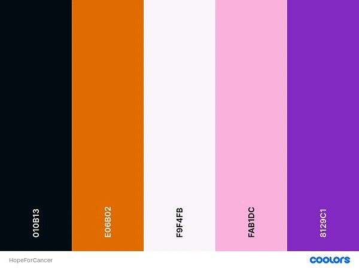

# HopeForCancer - Introduction

**Welcome to HopeForCancer**  
This is an informational blog webapp created using the Django Framework and related contemporary technologies, as a component of Portfolio Project 4 for my Diploma in Full Stack Software Development at Code Institute.

**Our Story**  
HopeForCancer is a web application that aims to raise awareness about cancer and provide resources to those affected by it. The idea for the project originated from a personal experience: the founder, **Edmir Demaj**, lost his father to cancer in November 2022. Recognizing the need for a comprehensive and user-friendly resource for those affected by cancer, Edmir set out to create a platform that would do just that. The mission of HopeForCancer is to provide support and information to cancer patients, survivors, and their families, and to spread awareness about the importance of early detection and prevention.

You can view the live site here: [HopeForCancer](https://hope-for-cancer.herokuapp.com/)

----

## [Content](#content)
- [HopeForCancer - Introduction](#hopeforcancer---introduction)
  - [User Experience - UX](#user-experience---ux)
    - [Site Aims](#site-aims)
    - [Target Audience](#site-aims)
    - [Agile Methodology](#agile-methodology)
      - [Epics and User Stories](#epics-and-user-stories)
  - [Design](#design)
    - [Colours](#colours)
    - [Typography](#typography)
    - [Imagery](#imagery)
    - [Wireframes](#wireframes)
  - [Database Diagram](#database-diagram)
  - [Features](#features)
    - [Home Page](#home-page)
      - [Navbar](#navbar)
      - [Hero Image](#hero-image)
      - [Cancer Information](#cancer-information)
      - [Understanding Cancer](#understanding-cancer)
      - [Latest Blog Post](#lates-blog-post)
      - [Footer](#footer)
    - [About us Page](#about-us-page)
      - [Hero Image](#hero-image)
      - [Our Mission](#our-mission)
      - [Our Values](#our-values)
      - [Our Team](#our-team)
    - [Cancer Info Page](#cancer-info-page)
      - [Hero Image](#hero-image)
      - [Cancer Facts](#cancer-facts)
      - [Cancer Types](#cancer-types)
      - [Detection & Prevent](#detection-&-prevent)
    - [Blog Page](#blog-page)
      - [Hero Image](#hero-image)
      - [Blog Post](#blog-post)
      - [Blog Details](#blog-details)
      - [Blog Comments](#blog-comments)
    - [Contact Page](#contact-page)
      - [Hero Image](#hero-image)
      - [Contact Form](#contact-form)
      - [FAQs](#faqs)
    - [Accounts](#register)
      - [Login](#login)
      - [Logout](#logout)
      - [Signup](#signup)
    - [Alert Messages](#alert-messages)      
  - [Admin Panel](#admin-panel)
  - [Technologies Used](#technologies-used)
    - [Languages Used](#languages-used)
    - [Packages](#packages)
    - [Frameworks - Libraries - Programs Used](#frameworks---libraries---programs-used)
  - [Testing](#testing)
      - [Validation](#validation)
      - [Manual Testing](#manual-testing)
  - [Bugs](#bugs)
      - [Fixed Bugs](#fixed-bugs)
      - [Unfix Bugs](#unfix-bugs)
  - [Deployment](#deployment)
      - [Creating the Django project](#creating-the-django-project)
      - [Creating Heroku app](#creating-heroku-app)
      - [Set up Environment Variables](#set-up-environment-variables)
      - [Heroku deployment](#heroku-deployment)
      - [Final Deployment](#final-deployment)
  - [Credits](#credits)
    - [Content](#content)
    - [Information Sources / Resources](#information-sources--resources)
  - [Acknowledgement](#acknowledgement)

-----

# User Experience - UX

## Site Aims

* Raise awareness about cancer and its impact on individuals, families, and communities.
* Provide educational resources about cancer, prevention and early detection.
* Empower and support individuals and families affected by cancer with access to information, resources, and community support.
* Foster a sense of connection and community among individuals affected by cancer, including survivors, patients, caregivers, and their loved ones.
* Promote a positive and compassionate approach to cancer care and support.
* Provide a user-friendly and accessible platform for individuals to find information, connect with resources, and share their experiences.

## Target Audience

**Primary Target Audience:**
* Individuals who have been diagnosed with cancer and their families
* Cancer survivors and their families
* Individuals who are at high risk of developing cancer

**Secondary Target Audience:**
* General audience interested in learning about cancer prevention and treatment
* Healthcare professionals and cancer organizations

## Agile Methodology

The Agile methodology was chosen for this project to ensure flexibility and responsiveness to changes that may arise during the development process. It is used Github and the Project Board to implement Agile practices. User stories were initially entered into the 'To Do' column on the Kanban board, which served as the project's backlog. As development progressed, user stories were moved into the 'In Progress' column. Once a user story was fully developed, it was moved to the 'Done' column. This process allowed for continuous development and testing, with the ability to pivot and make changes as needed. Overall, the use of Agile methodology and the Kanban board in Github was effective in keeping the work organized and on task, resulting in a successful project.

Please find my GitHub Kanban Board with all Epics, User Stories and Tasks [here.](https://github.com/users/Edmir-Demaj/projects/4)

Please find my Epic & User Story templates:

Please find my Milestone project:

## Epics and User Stories

Epic 1: User experience and interface design.

---

### User Story 1.1: Visually appealing website layout.
- As a **Site User**, I want to **see that the website has a visually appealing layout**, so that I **enjoy using it and am more likely to return to it.**

### Tasks:
* Get inspiration from modern and visually appealing website layouts.
* Design and implement a colour palette that complements the website's purpose and is visually appealing.
* Choose and implement appropriate fonts that enhance readability.
* Create a layout that is clean and easy to navigate.
* Use proper images and icons for better UX.

### User Story 1.2: Clear and intuitive navigation menu.  
- As a **Site User**, I want to **see that the website has a clear and intuitive navigation menu**, so that I **can easily find the information I need.**

### Tasks:
* Create a wireframe of the navigation menu using a design tool.
* Develop the navigation menu template using HTML and style it with CSS or Bootstrap.
* Implement interactivity to the navigation menu.
* Test the navigation menu functionality.

### User Story 1.3: Responsive design.  
- As a **Site User**, I want to **navigate a responsive design**, so that I **can access it from any device and screen size.**

### Tasks:
* Create a custom responsive design or use a responsive framework.
* Test the website on different screen sizes and devices to ensure proper layout and functionality, mostly during the development stage.

### User Story 1.4: Website loading time.  
- As a **Site User**, I want to **see a quick loading time for the website**, so that I **don't have to wait a long time to access the information I need.**

### Tasks:
* Optimize images and other media files to reduce their size and improve loading speed.
* Minimize the use of external scripts and resources that can slow down the website.
* Use a content delivery network (CDN) to distribute the website content.
* Test the website with Google Lighthouse for performance and follow the feedback to improve loading speed.

### User Story 1.5: Accessible design.  
- As a **Site User**, I want to **navigate a website that has an accessible design**, so that I **or people with disabilities can use it easily.**

### Tasks:
* Use semantic HTML markup to provide structure and context for screen readers.
* Add alt tags to all images.
* Use colour contrast.
* For all form fields use labels.
* Use aria-label for internal & external links.

Epic 2: Home/Landing page.

---

### User Story 2.1: Website purpose.
- As a **First-Time User**, I want to **be able to easily understand the purpose of the website**, so that I **can get a fast understanding of what is about.**

### Tasks:
* Create a hero section on the landing page with a clear message about the purpose of the website and a meaningful image.
* Design a logo that describes the purpose of the website.
* Use colours that can define the purpose of the website.

### User Story 2.2: Quick access to main information.
- As a **Site User**, I want to **quickly access main information about cancer**, so that I **don't need to read other materials in which I might not have an interest.**

### Tasks:
* Create a Call To Action button CTA, which will bring the user to the Cancer Information page.
* Style this button with eye-catching colour and proper size.

### User Story 2.3: Brief introduction.
- As a **First-Time User**, I want to **be able to get a brief introduction about cancer**, so that I **can understand what this website cover and if I want to stay or leave the site.**

### Tasks:
* Provide 3 cards with a brief introduction to What is Cancer, the Types of Cancers and the Importance of Early Detection.
* Give these Cards an appealing layout and style.
* Add to each Card an image that gives meaning to the content.
* Create a button if the user wants to learn more about the related subtopic.

### User Story 2.4: Select a topic related to cancer.
- As a **Site User**, I want to **be able to select a topic related to cancer**, so that I **can easily find information on the topic I am interested in.**

### Tasks:
* Create a dropdown menu for selecting topics.
* Populate the dropdown menu with a list of topics related to cancer.
* Ensure that the selected topic is saved and displayed on the page.
* Test the dropdown menu functionality to ensure it is working as expected.

### User Story 2.5: Latest Blog posts on Home page.
- As a **Site User**, I want to **see a section on the home page that displays the latest blog posts**, so that I **can easily access and read the most recent posts.**

### Tasks:
* Create a section on the home page to display the latest blog posts.
* Design the layout of the blog post section on the home page.
* Implement a function to retrieve the latest 3 blog posts from the database.
* Test the functionality and appearance of the blog post section on the home page.

Epic 3: About this web application.

---

### User Story 3.1: Web application mission.
- As a **First-Time User**, I want to **easily understand the mission of the website**, so that I **can understand if is the right website I am looking for.**

### Tasks:
* Create a website mission section and provide this information to the user with text and a related image.
* Create a clean design for this section.
* Provide a short and clean mission message to the user.

### User Story 3.2: Web application values.
- As a **First-Time User**, I want to **understand the values of this website**, so that I **can understand how the site treats cancer in the community and if is helpful for me.**

### Tasks:
* Add a section where all the values of using this website are listed and explained to the user.
* Describe these values as short as possible.
* Provide images to give meaning to each value section.

### User Story 3.3: Team behind the website.
- As a **First-Time User**, I want to **know about the team behind this website**, so that I **know who is providing these services.**

### Tasks:
* Add a section where is described team behind planning and developing this website.
* Add an image of the team in order to be more friendly with users and make them feel secure while using the site.

Epic 4: Cancer Information.

---

### User Story 4.1: Key cancer facts.
- As a **Site  User**, I want to **be able to see key cancer facts**, so that I **can easily understand and remember important information about cancer.**

### Tasks:
* Create or find an image that presents the information in an understandable and visually appealing way.
* Ensure the image is optimized for fast loading and compatible with different devices and screen sizes.
* Add alternative text to the image for users who may have difficulty seeing the image.

### User Story 4.2: Detailed information about cancer.
- As a **Site User**, I want to **easily access detailed information about cancer, including its types, causes, prevention, and importance of early detection**, so that I **can educate myself on this disease and take necessary precautions.**

### Tasks:
* Research and gather information on different types of cancers, causes, and preventive measures.
* Create an organized and easy-to-understand format for presenting the information on the website.
* Test the information layout and design for user-friendliness and readability.

### User Story 4.3: Access to external resources.
- As a **Site User**, I want to **be able to access more detailed and professional information about cancer provided by experts and is up-to-date**, so that I **can get answers to many more questions I might have and help me better understand cancer in general.**

### Tasks:
* Create a button to engage users with external resources.
* Design an appealing button.
* Add functionality and test it.

Epic 5: Blog posts managment.

---

### User Story 5.1: All blog posts.
- As a **Site User**, I want to **be able to view all blog posts**, so that I **can stay up-to-date on the latest content and see all posts.**

### Tasks:
* Create a blog post section that displays the most recent posts at the top.
* Include the post title, author, date, and a brief summary.
* Create database models for posts, categories, and comments and migrate them.
* Create URLs and views to render data from the backend to the front for users.

### User Story 5.2: Apply CRUD for User/Admin post.
- As a **Site User/Admin**, I want to **be able to create, read, update, and delete posts**, so that I **can manage the content I share on the website.**

### Tasks:
* Create a form for users/admin to add new posts.
* Create a page to display all posts.
* Implement an edit button for users/admins to modify their posts.
* Implement a delete button for users/admins to remove posts.
* Implement a confirmation message for deleting posts.
* Validate post data on the server side to prevent incorrect information.

### User Story 5.3: Delete comments before aproval.
- As an **Admin**, I want to **to review and delete comments before approving them**, so that I **filter out objectionable comments and maintain the quality of content on the website.**

### Tasks:
* Add a feature to the admin dashboard that displays all pending comments.
* Allow the admin to read each comment and decide whether to approve or delete it.
* If the admin approves a comment, add it to the website's comment section for that post.

### User Story 5.4: Detailed Blog post.
- As a **Site User**, I want to **be able to view a single blog post in detail**, so that I **can read more information about a particular post.**

### Tasks:
* Design a layout for displaying a single blog post in detail, with clear headings and text.
* Create a button or link to navigate to the single post page from the main blog page.
* Ensure that the single post page is responsive to different screen sizes.

Epic 6: Comment and Like managment.

---

### User Story 6.1: Leave comments on a post.
- As a **Logged-In User**, I want to **leave comments on a post**, so that I **so that I can participate in discussions and share my thoughts with others.**

### Tasks:
* Implement a comment section on each post page.
* Allow logged-in users to submit comments and associate them with the post.
* Validate comments to ensure they meet site guidelines and do not contain inappropriate content.
* Store comments in a database and retrieve them when the posting page is loaded.
* Display comments below the post content, with the most recent comments shown first.
* Provide an option for users to edit or delete their own comments.

### User Story 6.2: Like or Unlike a post.
- As a **Logged-In User**, I want to **be able to like or unlike a post**, so that I **can show my appreciation or dislike for the content.**

### Tasks:
* Implement a like/unlike button on each post.
* Store user's like/unlike status in the database.
* Update the number of likes/unlikes on the post in real time.

Epic 7: Registration and account managment.

---

### User Story 7.1: Register an account.
- As a **Site User**, I want to **register an account**, so that I ** can interact with the content by commenting and liking posts.**

### Tasks:
* Create a user registration page with appropriate input fields for username, email, and password.
* Implement server-side validation for the registration form to ensure that all required fields are filled out and that the username and email are unique.
* Create a login page that allows users to enter their credentials and authenticate their accounts.
* Allow registered users to leave comments and like posts.

### User Story 7.2: Log In and Log Out from the site.
- As a **Registered Site User**, I want to **be able to log in and log out of the site**, so that I **can access my account information and manage my content.**

### Tasks:
* Create a login page with input fields for username and password.
* Implement an authentication system to verify user credentials upon login attempt.
* Create a logout button or link that logs the user out of their session.

### User Story 7.3: Create posts as a registered user.
- As a **Registered Site User**, I want to **create posts**, so that I **can share my stories and get involved with the site community.**

### Tasks:
* Design the UI for creating a post.
* Implement a form for creating a post with fields such as title, content, category, tags, and featured image.
* Validate the user inputs to ensure that they are not empty or invalid.
* Display a success message to the user after the post is created.
* Allow the user to edit and update their posts.
* Display a confirmation message before deleting a post.

Epic 8: Contact page funcionality.

---

### User Story 8.1: Contact form.
- As a **Site User**, I want to **be able to fill out a contact form**, so that I **can send a message to the website administrators.**

### Tasks:
* Create a simple contact form with fields for name, email, subject, and message.
* Ensure that the form is properly validated and any errors are displayed to the user.

### User Story 8.2: Receive messages from contact form.
- As an **Admin**, I want to **be able to receive messages sent via the contact form**, so that I **provide support and assistance to site users.**

### Tasks:
* Set up a system to receive email notifications when a contact form is submitted.
* Consider adding an FAQ  to the website to proactively address common questions or issues raised via the contact form.

# Design

## Colours

The color palette for this project features five main colors:  
#010B13 - this is a very dark blue, almost black color  
#F9F4FB - this is a very light pinkish-white color  
#FAB1DC - this is a light pink color often associated with breast cancer awareness  
#E06B02 - this is an orange color often associated with kidney and leukemia cancer  
#8129C1 - this is a bright purple color, often associated with cancer awareness   

The background of the site is set to light-pinkish, creating a calm and clean atmosphere. The navbar uses light pink, which is the color commonly associated with breast cancer awareness. The color bright orange is used to emphasize important words or keywords on the site. Bright purple is another color that is used for emphasis,mostly buttons, and is often associated with all types of  cancer. Lastly, dark blue is used for text to provide a good contrast against the background and improve readability.  Overall, the color palette is designed to create a visually appealing and informative experience for users.

## Typography

For typography, the web app uses Google Fonts. The header font is Montserrat, which has a modern and clean style that creates a great visual impact. For the body text, Merriweather is used, a font that enhances readability and provides a comfortable reading experience. As a backup fonts are used Sans-Serif and Serif. Together, these fonts create a professional and visually pleasing design that aligns with the web app's mission of raising awareness about cancer.

## Imagery

All images used on this project are free copyrights. They are used to convey a message or evoke a particular emotion related to the subject of cancer. Also they are used to add visual interest to the website and to help break up text-heavy pages like about or info page. Imagery is relevant to the content and mission of the website and is also appropriately sized and optimized for web use to ensure fast page loading times. All images are in .webp format.

## Wireframes

All of the wireframes for the web app were created using [Figma](https://www.figma.com/), a popular design tool known for its versatility and collaborative features. During design stage was kept in mind the principles of UX (User Experience) and UI (User Interface) design throughout the process to ensure that our wireframes are intuitive, user-friendly, and visually appealing. Additionally, the wireframes are responsive and optimized for use on tablets and mobile devices, to provide a seamless experience across different screen sizes.

Home Page:

About us Page:

Info Page:

Blog Page:

Contact Page:

Login & Signup Page:

Post Details Page:

Create Post Page:

# Database Diagram
[SmartDraw](https://www.smartdraw.com/) was used to create and design the database schema for the project. This schema served as a guiding blueprint for every database model implemented. Below, you will find the database structure for each Django app utilized in the HopeForCancer project. The schema effectively illustrates each entity and any existing relationships between them.

[Back to top ⇧](#content)
# Features

## Home Page

### Navbar

# Admin Panel/Superuser

# Technologies Used

# Testing

# Bugs

## Fixed Bugs
## Unfixed Bugs

# Deployment

# Credits

## Content
## Information Sources / Resources

# Acknowledgement
