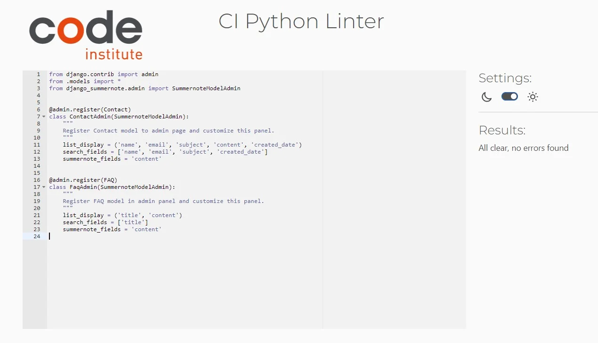

# HopeForCancer - Testing

[Return to README.md](README.md)

## Table of Contents
- [Performance](#performance)
  - [Google's Lighthouse Performance](#googles-lighthouse-performance)
- [Automated Testing](#automated-testing)
  - [HTML Validator](#html-validator)
  - [CSS Validator](#css-validator)
  - [Python Validator](#python-validator)
 - [Manual Testing (BDD)](#manual-testing-bdd)
    - [Testing User Stories](#testing-user-stories)
    - [Full Testing](#full-testing )
- [Features Testing](#features-testing)

---

## Performance

### Google's Lighthouse Performance
To assess the performance of the website, the [Google Lighthouse](https://developers.google.com/web/tools/lighthouse) tool was utilized. The website received a remarkable performance score of `99 on desktop devices`, indicating excellent performance. However, on mobile devices, the score was `88`, indicating room for improvement. The main contributing factor to this score was identified as the large size of user-uploaded images, which had a significant impact on performance. To address this issue, a future plan is to implement a feature that automatically converts images of any format to the more optimized WebP format.

During the evaluation process, the website underwent testing in various categories, including:
- Performance
- Accessibility
- Best practices
- SEO
- Progressive Web App

#### Desktop Results:
.

#### Mobile Results:
.

## Automated Testing

### HTML Validator
The HTML code used in this project was manually entered into the [W3C Markup Validation Service](https://validator.w3.org/) for validation. After the validation process, minor errors and warnings were identified. However, they have been addressed and resolved. Below are the screenshots of each page along with the corresponding validation results:

Home page

About us page

Cancer Info page

Blog page

Contact page

Post Detail page

Create Post page

Edit comment page

---

### CSS Validator
The CSS code utilized in this project was manually inputted into the [Jigsaw CSS validator](https://jigsaw.w3.org/css-validator/) for validation. Following the validation process there were no errors detected in code. Presented below is the screenshot of the results: 

CSS validation results

---
### Python Validator
The Python code utilized in this project was manually inputted into the [PEP8 CI Python Linter](https://pep8ci.herokuapp.com/) for validation. This validation checks if code written in Python met PEP8 requirements. Validation was divided in 3 stages, one for each app and each Python file inside. Following the validation process there were no errors detected in code. Presented below are the screenshots of each app/file with the results:

#### Blog App

 admin.py

 forms.py

 models.py

 urls.py

 views.py

---

#### Contact App

 admin.py

 forms.py

 models.py

 urls.py

 views.py

---

#### Other_Pages App

 admin.py

 models.py

 urls.py

 views.py

[Back to top ⇧](#content)

## Manual Testing (BDD)

Behaviour Driven Development (BDD) is a testing approach that enables the evaluation of user stories in a user-friendly manner, making it accessible to individuals without technical expertise. This methodology facilitates the testing of various app features by breaking down complex scenarios into understandable and relatable behaviors.

### Testing User Stories

| User Story | BDD Test | Pass |
| :--- | :--- | :--- |
| `First Time Site User` |
|  |  |  |
| As a First-Time  User, I want to be able to easily understand the purpose of the website, so that I can get a fast understanding of what is about. | Given that I'm a first time User and when I open Home page i can see clear messages and meaningful images  with a nice logo so I understand what is about the site. | Pass |
| As a First-Time User, I want to be able to get a brief introduction about cancer, so that I can understand what this website cover and if I want to stay or leave the site. | Given that I'm a first time User and when I scroll down Home page i can see 3 different cards with brief introduction to the most important content about the site purpose which increase my curiosity to read more. | Pass |
| As a First-Time User, I want to easily understand the mission of the website, so that I can understand if is the right website I am looking for. | Given that I'm a first time User and to understand more about website mission i can easily get this information from About us page with very clear and short message. | Pass |
| As a First-Time User, I want to understand the values of this website, so that I can understand how the site treats cancer in the community and if is helpful for me. | Given that I'm a first time User and when I scroll down the About us page i can easily identify the Values of the website. | Pass |
| As a First-Time User, I want to be able to easily navigate the site without to much confusions. | Given that I'm a first time User and when I enter in this site I can see an easy to navigate navbar with links and many helpful buttons/links around the site to access additional resources or to return back to the previous page. | Pass |
| As a First-Time User, I want to be able to Register for an account. | Given that I'm a first time User and on navbar I can easily identify the 'Sign up' link with a simple form to register my account. | Pass |
|`Returning Users`|
|  |  |  |
| As a returning User, I want to be able to Login to my account so i can get easily access to website restricted features. | Given that I'm a site User and every time I use the site can easily Login with simple form.| Pass |
| As a returning User, I want to see latest post from other users without need to scroll the Blog page. | Given that I'm a site User and every time I use the site I can view the latest 3 posts updated in Home page. | Pass |
| As a returning User, I want to stay updated with latest news and accurate information about cancer. | Given that I'm a site User and every time I use the site can select the topic I'm interested from a dropdown menu and can easily visit other professional websites so I can get the information I want. | Pass |
| As a returning User, I want to create a post and engage with community. | Given that I'm a site User and every time I return back can click on create post buttons around the site and share my stories with others. | Pass |
| As a returning User, I want to be able to access the site from different devices. | Given that I'm a site User and I am able to access the site in different devices without losing layout design or funcionality. | Pass |
| As a returning User, I want to comment on a post so I can share my thoughts about the post. | Given that I'm a site User and when I loggin to my account I can just click the post I want to leave a comment and submit it via an easy form. | Pass |
| As a returning User, I want to understand when my interactions with site are finished or failed. | Given that I'm a site User and when I login or logout, when I like posts, leave comments and more I'm always provided with short clear feedback message. | Pass |
| As a returning User, I want to be able to edit one of my posts or comments. | Given that I'm a site User and when I want to edit a comment or post I can easily do it via edit buttons. | Pass |
| As a returning User, I want to be able to view which post has more likes or comments so might be interesting to read it. | Given that I'm a site User and when I navigate through posts I can see the number of likes and comments for each post. | Pass |
|`Admin User` |
| As a site Admin, I want to be able to have my dashboard so I can easily access site funcionality. | Given that I'm a site Admin and when I login to my admin site with my unique credentials I'm able to see my dashboard and navigate to different parts of funcionality the site provides. | Pass |
| As a site Admin, I want to be able to view all Users of the site who have already an account registered. | Given that I'm a site Admin and on my dashboard I can view all site Users who have an account registered and their details. | Pass |
| As a site Admin, I want to be able to create, read, update posts. | Given that I'm a site Admin and on my dashboard I can apply all CRUD funcionality. | Pass |
| As a site Admin, I want to be able to review posts before posting them to maintain the quality of content on the website. | Given that I'm a site Admin and on my dashboard I can view all posts with  status 'Draft', can review them and post after. | Pass |
| As a site Admin, I want to be able to review comments before posting them to maintain the quality of content on the website. | Given that I'm a site Admin and on my dashboard I can view all comments with  status 'Draft', can review them and make public. | Pass |
| As a site Admin, I want to be able to update website values or FAQs. | Given that I'm a site Admin and on my dashboard I access this two sections and update or add new ones when is required to keep site content up-to-date. | Pass |
| As a site Admin, I want to be able to receive messages sent by Users so i can respond to them via email. | Given that I'm a site Admin and on my dashboard I can view all messages sent via contact form on Contact page and their details. | Pass |
|  |  |  |

- - -